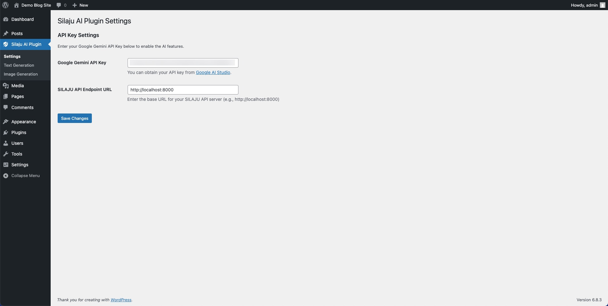
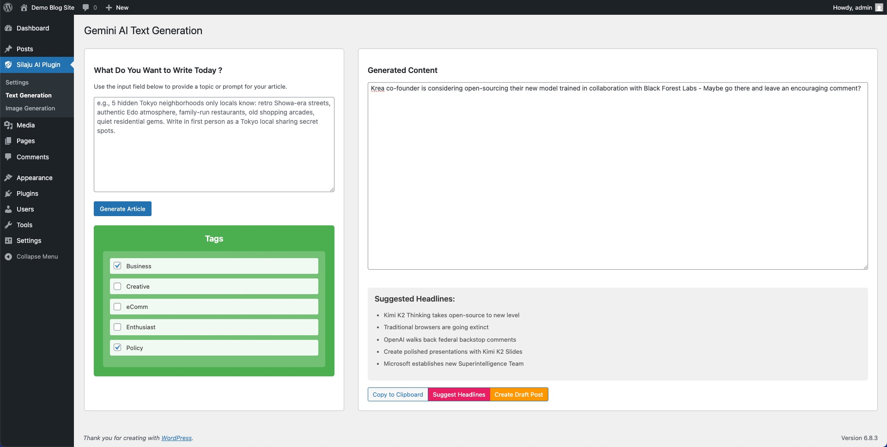
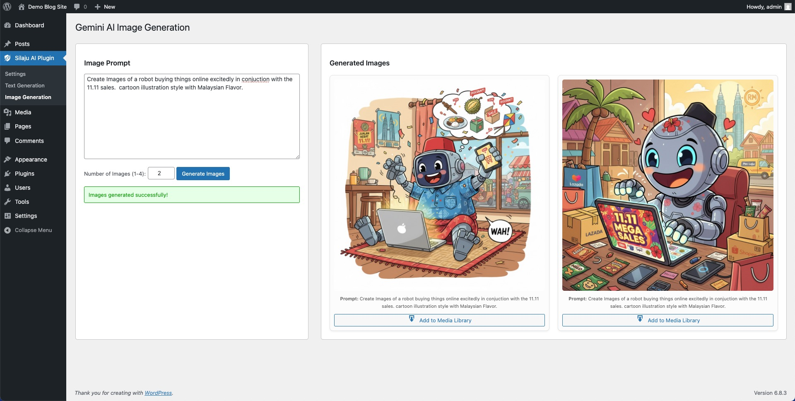
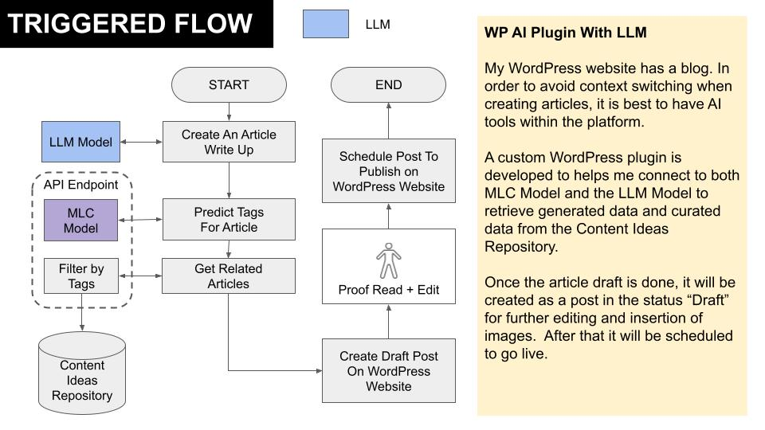

# Silaju AI Plugin

A WordPress plugin to generate AI-powered text and images using the Google Gemini API and to integrate with a SILAJU API endpoint for recommended articles suggestions and draft creation.

---

## Features

- Generate articles and other text content using Google Gemini (via the Google Generative Language API).
- Generate images using Google Gemini image model and preview them in the admin.
- Save generated images directly to the WordPress Media Library.
- Suggest headlines by calling a configurable SILAJU API endpoint (useful for editorial workflows).
- Create draft posts from generated content and attach selected tags.
- Admin pages for Settings, Text Generation and Image Generation with a responsive UI and helpful controls.

---

## Screenshots

Below are screenshots from the plugin admin pages (stored in the `screenshots/` folder):

*Settings page — enter Google Gemini API Key and SILAJU endpoint.*

*Text Generation admin UI — prompt, generated content, tags, headlines and create draft actions.*

*Image Generation admin UI — prompt, number of images, generated gallery and save to Media Library.*

*How a content creation workflow looks like when using this plugin*

---

## Requirements

- WordPress (recommended 5.8+; tested on recent WP versions)
- PHP 7.4+ (or later)
- A Google Gemini API key (obtainable via Google AI Studio / Generative Language APIs)

Note: If you will use the SILAJU headline suggestion feature, you should run (or point to) a SILAJU-compatible API server and provide its base URL in plugin settings.

Related Project Here : https://github.com/wycoconut/silaju-project

## Installation

1. Copy the `silaju-ai-plugin` folder into your site's `wp-content/plugins/` directory.
2. Activate the plugin from the WordPress admin under Plugins.
3. Open the plugin admin menu (left sidebar) called `Silaju AI Plugin`.

## Setup

1. Go to `Silaju AI Plugin -> Settings`.
2. Enter your Google Gemini API Key in the **Google Gemini API Key** field.
3. (Optional) Enter your SILAJU API Endpoint URL (for local or hosted SILAJU services), e.g. `http://localhost:8000`.
4. Save settings.

Security: the plugin uses WordPress nonces and AJAX endpoints. Do not share your API key. The plugin stores the API key in a WordPress option; for extra security, consider using environment variables or secret management plugins if needed.

## Admin Pages / Usage

The plugin adds a top-level admin menu named `Silaju AI Plugin` with the following sub-pages:

- Settings (default) — configure Google Gemini API Key and the SILAJU API endpoint.
- Text Generation — generate AI text and optionally:
	- Load and select tags from your WordPress site's tags.
	- Generate content from a prompt (uses AJAX to call Google Gemini Generative API).
	- Suggest headlines (calls the configured SILAJU API endpoint to return related article headlines).
	- Create a draft post from generated content and assign selected tags.

- Image Generation — generate images from a prompt (1–4 images). Generated images are returned as base64 data and shown in an image gallery where you can:
	- Preview generated images.
	- Save any generated image to the WordPress Media Library (the plugin writes the decoded file to the uploads folder and creates an attachment).

Buttons and helpful behaviors (from admin UI):

- Generate Article / Generate Images — triggers AJAX requests to endpoints registered in the plugin (`silaju_ai_generate_text` and `silaju_ai_generate_image`).
- Add to Media Library — saves a selected image (AJAX action `silaju_save_image`).
- Suggest Headlines — requests headline suggestions from the SILAJU endpoint (AJAX action `silaju_suggest_headlines`).
- Create Draft Post — creates a WordPress draft using `wp_insert_post` (AJAX action `silaju_create_draft_post`).

All AJAX calls are protected by nonces which are localized to the admin JS via `silaju_ai_ajax_object`.

## Plugin Files of Interest

- `silaju-ai-plugin.php` — main plugin bootstrap: registers admin pages, enqueues assets, defines AJAX handlers.
- `admin/text-generation.php` — UI for text generation and headline suggestions.
- `admin/image-generation.php` — UI for image generation and media save buttons.
- `admin/settings.php` — settings page (API key + SILAJU endpoint URL).
- `assets/js/script.js` — JavaScript handling AJAX calls and UI interactions.
- `assets/css/style.css` — admin page styles.

## SILAJU Integration

The plugin supports a configurable SILAJU API endpoint (via `SILAJU API Endpoint URL` in settings). The headline suggestion feature calls the `/data/relatedarticles` route with parameters derived from selected tags and expects JSON containing article objects with a `headline` field.

If you run a local SILAJU server, set the endpoint to `http://localhost:8000` or the appropriate host/port.

## Troubleshooting

- "API Key is not set" errors — ensure you entered a valid Google Gemini API Key in the plugin settings.
- Long-running image generation — image generation requests may take a while (the plugin uses up to 90s timeout). If requests time out, check network connectivity and the Google API status.
- Invalid image save / permissions error — ensure the `wp-content/uploads` directory is writable by your PHP process.
- Nonce/security errors — perform a hard refresh in the WP admin or re-open the settings page to refresh localized nonces.

## Privacy & Data

Generated images saved via the plugin are stored in your WordPress Media Library. Generated text is only returned to the admin screen and is not stored unless you create a draft. The plugin sends prompts to external APIs (Google Gemini and optionally your SILAJU endpoint) — be mindful of any privacy policies or PII in prompts.

## Contributing

Contributions, bug reports and suggestions are welcome. Open issues or PRs on GitHub and follow standard coding and security practices. Small UI accessibility and error-handling improvements are good places to start.

## License

This plugin is released under the GPL-2.0-or-later license (as indicated in the plugin header). See the project license file for details.

## Author / Support

Author: Wan Yuee Low
Website: https://www.librokloud.com/

For support or enquiries open an issue or contact the author via the website.

## Changelog

- 1.0.0 — Initial release: text & image generation, save images to media library, headline suggestions, create draft posts.

---

If you'd like, I can also:

- Add screenshots for the admin pages.
- Add a short GitHub Actions workflow to run basic spellcheck/lint on the README.
- Add a sample `.env` example or guidance on storing the API key via constants or environment variables.

Let me know and I will add those.
